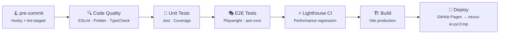
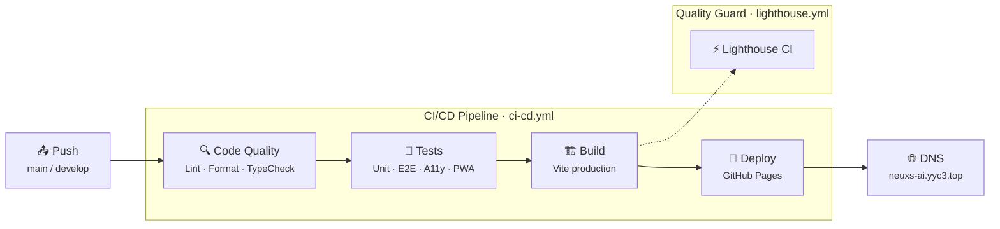

<p align="center">
  <picture>
    <source media="(prefers-color-scheme: dark)" srcset="./public/Family-001.png">
    
  </picture>
</p>

<!-- ====================================================================== -->
<!--                         HEADLINE · 标题区                                -->
<!-- ====================================================================== -->

<h1 align="center">
  <a href="https://neuxs-ai.yyc3.top" target="_blank" rel="noopener noreferrer">
    
    YYC³ AI App Intelligence Platform
  </a>
</h1>

<p align="center">
  <sub>
    <strong lang="zh-CN">言启象限 · 语枢未来</strong>
    &nbsp;—&nbsp;
    <em lang="en">Words Initiate Quadrants, Language Serves as Core for Future</em>
  </sub>
</p>

<p align="center">
  <strong lang="zh-CN">企业级 AI 移动应用智能分析平台 · 面向 AI 时代的 App 全链路决策引擎</strong><br/>
  <small lang="en">Enterprise-grade AI mobile app intelligence platform — an AI-native, full-link decision engine for mobile app developers</small>
</p>

<p align="center">
  <a href="https://neuxs-ai.yyc3.top" target="_blank" rel="noopener noreferrer">
    
  </a>
  &nbsp;
  <a href="https://github.com/YYC-Cube/YYC3-AI-App-Intelligence-Platform" target="_blank" rel="noopener noreferrer">
    
  </a>
</p>

---

<!-- ====================================================================== -->
<!--                     BADGE SYSTEM · 徽章系统                              -->
<!-- ====================================================================== -->

## 📜 Badge System · 徽章系统

<!-- ========== Row 1: 核心身份 · Core Identity ========== -->

<p align="center">
  
  
  
  
</p>

<!-- ========== Row 2: CI/CD 流水线 · Pipeline Status ========== -->

<p align="center">
  <a href="https://github.com/YYC-Cube/YYC3-AI-App-Intelligence-Platform/actions/workflows/ci-cd.yml">
    
  </a>
  <a href="https://github.com/YYC-Cube/YYC3-AI-App-Intelligence-Platform/actions/workflows/lighthouse.yml">
    
  </a>
  <a href="https://github.com/YYC-Cube/YYC3-AI-App-Intelligence-Platform/deployments">
    
  </a>
  <a href="https://neuxs-ai.yyc3.top">
    
  </a>
</p>

<!-- ========== Row 3: 技术栈 · Tech Stack ========== -->

<p align="center">
  
  
  
  
  
  
  
  
  
  
</p>

<!-- ========== Row 4: 质量工程 · Quality Engineering ========== -->

<p align="center">
  
  
  
  
  
  
  
  
</p>

<!-- ========== Row 5: 生态与社区 · Ecosystem & Community ========== -->

<p align="center">
  
  
  
  
  
  
  
  
  
  
</p>

---

<!-- ====================================================================== -->
<!--                  TABLE OF CONTENTS · 目录导航                            -->
<!-- ====================================================================== -->

## 📑 Table of Contents · 目录

<!-- TOC - 双栏表格：左侧中文 · 右侧英文 -->

| Chinese · 中文                                                                 | English · English                                               |
| ------------------------------------------------------------------------------ | --------------------------------------------------------------- |
| [📐 项目定位 · Project Overview](#-project-overview--项目定位)                 | [📐 Project Overview](#-project-overview--项目定位)             |
| [🧬 五高五标五化五维 · Architecture DNA](#-architecture-dna--五高五标五化五维) | [🧬 Architecture DNA](#-architecture-dna--五高五标五化五维)     |
| [🌐 线上体验 · Live Preview](#-live-preview--线上体验)                         | [🌐 Live Preview](#-live-preview--线上体验)                     |
| [✨ 功能矩阵 · Module Matrix](#-module-matrix--功能矩阵)                       | [✨ Module Matrix](#-module-matrix--功能矩阵)                   |
| [🗂️ 仓库结构 · Repository Layout](#-repository-layout--仓库结构)               | [🗂️ Repository Layout](#-repository-layout--仓库结构)           |
| [🎨 全端 Logo · Brand Asset Matrix](#-brand-asset-matrix--全端-logo)           | [🎨 Brand Asset Matrix](#-brand-asset-matrix--全端-logo)        |
| [🚀 快速开始 · Quick Start](#-quick-start--快速开始)                           | [🚀 Quick Start](#-quick-start--快速开始)                       |
| [🛡️ 五高架构 · Five-High Architecture](#-five-high-architecture--五高架构)     | [🛡️ Five-High Architecture](#-five-high-architecture--五高架构) |
| [🧪 质量与自动化 · Quality & Automation](#-quality--automation--质量与自动化)  | [🧪 Quality & Automation](#-quality--automation--质量与自动化)  |
| [📚 开发者文档 · Developer Docs](#-developer-docs--开发者文档)                 | [📚 Developer Docs](#-developer-docs--开发者文档)               |
| [🔄 CI/CD 与部署 · CI/CD & Deployment](#-cicd--deployment--cicd-与部署)        | [🔄 CI/CD & Deployment](#-cicd--deployment--cicd-与部署)        |
| [🤝 参与贡献 · Contributing](#-contributing--参与贡献)                         | [🤝 Contributing](#-contributing--参与贡献)                     |
| [🗺️ 路线图 · Roadmap](#-roadmap--路线图)                                       | [🗺️ Roadmap](#-roadmap--路线图)                                 |
| [📮 联系与支持 · Contact](#-contact--联系与支持)                               | [📮 Contact](#-contact--联系与支持)                             |
| [📄 许可证 · License](#-license--许可证)                                       | [📄 License](#-license--许可证)                                 |

---

<!-- ====================================================================== -->
<!--                    PROJECT OVERVIEW · 项目定位                            -->
<!-- ====================================================================== -->

## 📐 Project Overview · 项目定位

YYC³ AI App Intelligence Platform（`YYC³-aiapp`）是 **YYC³ Family** 旗下的核心 Web 应用层，构建移动应用市场的「**洞察 → 决策 → 执行 → 反馈**」全链路智能闭环。

> **English**: YYC³ AI App Intelligence Platform (`YYC³-aiapp`) is the flagship web application layer of **YYC³ Family**, building the **Insight → Decision → Execution → Feedback** full-loop intelligent closed loop for the mobile app ecosystem.

| Dimension · 维度            | Description · 描述                                                                                                                                    |
| --------------------------- | ----------------------------------------------------------------------------------------------------------------------------------------------------- |
| **Platform · 平台定位**     | Enterprise AI intelligent application analytics platform (PWA + SPA dual-mode)                                                                        |
| **Users · 核心用户**        | Mobile app developers / growth teams / product managers / data analysts                                                                               |
| **Capabilities · 核心能力** | App intelligence · Market discovery · ASO · Creative analysis · Review intelligence · Monetization strategy · Pricing intelligence · AI learning loop |
| **Tech Stack · 架构范式**   | React 18 · Vite 5 · shadcn/ui · Radix UI · Tailwind 3 · Framer Motion · Recharts                                                                      |
| **Quality · 质量基线**      | TypeScript Strict · ESLint · Prettier · Husky · Jest · Playwright · Lighthouse · axe-core                                                             |

---

<!-- ====================================================================== -->
<!--                    ARCHITECTURE DNA · 五高五标五化五维                     -->
<!-- ====================================================================== -->

## 🧬 Architecture DNA · 五高五标五化五维

```text
┌──────────────────────────────────────────────────────────────────────┐
│              YYC³ 智能应用核心机制 · Core Intelligence Mechanism       │
├──────────────────────────────────────────────────────────────────────┤
│                                                                      │
│  五高架构 · Five-High Architecture                                    │
│  ┌──────────┬──────────┬──────────┬──────────┬──────────┐           │
│  │ 高可用   │ 高性能   │ 高安全   │ 高扩展   │ 高智能   │           │
│  │ HA       │ HP       │ HS       │ HE       │ HI       │           │
│  └──────────┴──────────┴──────────┴──────────┴──────────┘           │
│                                                                      │
│  五标体系 · Five-Standard System                                      │
│  ┌──────────┬──────────┬──────────┬──────────┬──────────┐           │
│  │ 标准化   │ 规范化   │ 自动化   │ 可视化   │ 智能化   │           │
│  │ Std      │ Norm     │ Auto     │ Vis      │ Intel    │           │
│  └──────────┴──────────┴──────────┴──────────┴──────────┘           │
│                                                                      │
│  五化转型 · Five Transformation                                       │
│  ┌──────────┬──────────┬──────────┬──────────┬──────────┐           │
│  │ 流程化   │ 数字化   │ 生态化   │ 工具化   │ 服务化   │           │
│  │ Process  │ Digital  │ Eco      │ Tool     │ Service  │           │
│  └──────────┴──────────┴──────────┴──────────┴──────────┘           │
│                                                                      │
│  五维评估 · Five-Dimensional Evaluation                               │
│  ┌──────────┬──────────┬──────────┬──────────┬──────────┐           │
│  │ 时间维   │ 空间维   │ 属性维   │ 事件维   │ 关联维   │           │
│  │ Time     │ Space    │ Attr     │ Event    │ Corr     │           │
│  └──────────┴──────────┴──────────┴──────────┴──────────┘           │
│                                                                      │
└──────────────────────────────────────────────────────────────────────┘
```

> 📖 **详细定义**: [`docs/YYC3-团队通用-标准规范/YYC3-核心机制-五高五标五化五维.md`](./docs/YYC3-团队通用-标准规范/YYC3-核心机制-五高五标五化五维.md)

---

<!-- ====================================================================== -->
<!--                      LIVE PREVIEW · 线上体验                            -->
<!-- ====================================================================== -->

## 🌐 Live Preview · 线上体验

| Environment · 环境        | URL · 地址                                                                                                           | Description · 说明                          |
| ------------------------- | -------------------------------------------------------------------------------------------------------------------- | ------------------------------------------- |
| **生产环境 · Production** | [**neuxs-ai.yyc3.top**](https://neuxs-ai.yyc3.top)                                                                   | GitHub Pages via DNS verified custom domain |
| **GitHub Pages (备用)**   | [yyc-cube.github.io/YYC3-AI-App-Intelligence-Platform](https://yyc-cube.github.io/YYC3-AI-App-Intelligence-Platform) | Default GitHub Pages domain                 |
| **本地开发 · Local Dev**  | [localhost:3200](http://localhost:3200)                                                                              | `pnpm dev`                                  |

---

<!-- ====================================================================== -->
<!--                    MODULE MATRIX · 功能矩阵                              -->
<!-- ====================================================================== -->

## ✨ Module Matrix · 功能矩阵

| Category · 类别                        | Modules · 模块                                    | Description · 描述                                                    |
| -------------------------------------- | ------------------------------------------------- | --------------------------------------------------------------------- |
| **Intelligence Hub · 分析枢纽**        | `Explorer` · `Trends` · `CrossAnalysis`           | App intelligence explorer, market trends, cross-module insight        |
| **ASO & Creative · ASO 与创意**        | `ASO` · `Creative` · `Paywall`                    | App Store Optimization, creative asset analysis, paywall strategy     |
| **Market & Strategy · 市场与策略**     | `Markets` · `Features` · `Pricing` · `Reviews`    | Market discovery, feature matrix, pricing intelligence, review mining |
| **Learning & AI · 学习与智能**         | `Learning` · `Assistant` · `Ideas`                | Feedback loop, knowledge graph, AI assistant, idea generation         |
| **Sales & Collaboration · 销售与协作** | `Sales` · `ABTesting` · `HumanAICollaboration`    | Sales pipeline, A/B experiments, human-AI collaboration               |
| **PWA & Accessibility · PWA 与可达性** | `PWAProvider` · `InstallPrompt` · `Accessibility` | Offline-ready, install prompt, WCAG 2.2 AA compliance                 |

---

<!-- ====================================================================== -->
<!--                REPOSITORY LAYOUT · 仓库结构                             -->
<!-- ====================================================================== -->

## 🗂️ Repository Layout · 仓库结构

```text
YYC3-AI-App-Intelligence-Platform/
│
├── public/
│   ├── Family-001.png                  ← YYC³ Family 全家福 · README 顶图
│   └── yyc3-icons/                     ← 🎨 全端 Logo 资产
│       ├── android/                    │   mipmap-hdpi…xxxhdpi + playstore-icon
│       ├── ios/                        │   20px→1024px 全尺寸 App Store 图标
│       ├── pwa/                        │   72×72→512×512 + manifest.json
│       ├── favicon/                    │   16/32/96 + favicon.ico
│       └── webp/                       │   192/512 WebP 优化版
│
├── components/
│   ├── ui/                             ← shadcn/ui 组件库 (48+ 原子组件)
│   ├── modules/                        ← 业务模块 (20+ 智能模块)
│   │   ├── aso/          creative/     cross-analysis/   explorer/
│   │   ├── features/     ideas/        learning/         markets/
│   │   ├── paywall/      pricing/      reviews/          sales/
│   │   └── trends/
│   ├── nara/                           ← NARA 控制台 (Home / Chat / Loop)
│   ├── pwa/                            ← PWA Provider / InstallPrompt / Status
│   └── accessibility/                  ← 可访问性增强组件
│
├── __tests__/                          ← Jest 单元测试
│   ├── accessibility/    components/    hooks/
│   ├── performance/      pwa/           setup/    utils/
│   └── tsconfig.json
│
├── docs/                               ← YYC³ 标准规范 & 设计文档
│   ├── YYC3-团队通用-标准规范/
│   ├── architecture/                   ← 导航架构分析/分类/整合报告
│   └── accessibility/
│
├── .github/workflows/                  ← CI/CD 自动化流水线
│   ├── ci-cd.yml                       │   CI/CD: Lint → Test → Build → E2E → LH → Deploy
│   └── lighthouse.yml                  │   Lighthouse CI: Performance regression guard
│
├── .husky/pre-commit                   ← Git pre-commit hooks
│
├── vite.config.ts                      ← Vite + VitePWA 配置
├── package.json                        ← pnpm scripts & dependencies
│
├── index.html                          ← HTML 入口 (全端 Logo 引用)
├── App.tsx                             ← App 根组件
├── Router.tsx                          ← 路由配置
│
├── LICENSE                             ← MIT License
├── CONTRIBUTING.md                     ← 贡献指南
├── CODE_OF_CONDUCT.md                  ← 行为准则
├── CHANGELOG.md                        ← 变更日志
└── SECURITY.md                         ← 安全策略
```

---

<!-- ====================================================================== -->
<!--                  BRAND ASSET MATRIX · 全端 Logo                         -->
<!-- ====================================================================== -->

## 🎨 Brand Asset Matrix · 全端 Logo

YYC³ Logo 已在 [`public/yyc3-icons/`](./public/yyc3-icons) 下提供 **Android / iOS / PWA / Favicon / WebP** 全端适配资产。

> **English**: The YYC³ Logo is fully provisioned under `public/yyc3-icons/` with complete cross-platform assets for Android, iOS, PWA, Favicon, and WebP.

### Entry Points · 引入入口

| Entry · 入口         | Assets · 引入资产                                                           | Source · 路径                         |
| -------------------- | --------------------------------------------------------------------------- | ------------------------------------- |
| **HTML `<head>`**    | favicon · apple-touch-icon · manifest                                       | [`index.html`](./index.html)          |
| **`<head>` Favicon** | `favicon.ico` (multi-res) · 16/32/96 PNG                                    | `public/yyc3-icons/favicon/`          |
| **`<head>` iOS**     | `apple-touch-icon` 180×180 · 167×167 · 152×152 · 120×120 · 80×80            | `public/yyc3-icons/ios/`              |
| **PWA Manifest**     | 72×72 → 512×512 (maskable) · WebP 优化                                      | `public/yyc3-icons/pwa/manifest.json` |
| **VitePWA Config**   | `includeAssets` + `manifest.icons` + `workbox`                              | [`vite.config.ts`](./vite.config.ts)  |
| **Android**          | mipmap-hdpi → xxxhdpi (`ic_launcher` · `round` · `foreground`) · Play Store | `public/yyc3-icons/android/`          |

### Asset Inventory · 资产清单

```text
public/yyc3-icons/
├── android/
│   ├── mipmap-mdpi/    (48×48)       ic_launcher.png · ic_launcher_foreground.png · ic_launcher_round.png
│   ├── mipmap-hdpi/    (72×72)       ic_launcher.png · ic_launcher_foreground.png · ic_launcher_round.png
│   ├── mipmap-xhdpi/   (96×96)       ic_launcher.png · ic_launcher_foreground.png · ic_launcher_round.png
│   ├── mipmap-xxhdpi/  (144×144)     ic_launcher.png · ic_launcher_foreground.png · ic_launcher_round.png
│   ├── mipmap-xxxhdpi/ (192×192)     ic_launcher.png · ic_launcher_foreground.png · ic_launcher_round.png
│   └── playstore-icon.png (512×512)  Google Play Store listing icon
│
├── ios/
│   ├── icon-20.png · icon-20@2x.png · icon-20@3x.png
│   ├── icon-29.png · icon-29@2x.png · icon-29@3x.png
│   ├── icon-40.png · icon-40@2x.png · icon-40@3x.png
│   ├── icon-60@2x.png · icon-60@3x.png
│   ├── icon-76.png · icon-76@2x.png · icon-83.5@2x.png
│   ├── icon-20-ipad.png · icon-20@2x-ipad.png
│   ├── icon-29-ipad.png · icon-29@2x-ipad.png
│   ├── icon-40-ipad.png · icon-40@2x-ipad.png
│   └── icon-1024.png     ← App Store Connect 1024×1024
│
├── pwa/
│   ├── icon-72x72.png    icon-96x96.png   icon-128x128.png
│   ├── icon-144x144.png  icon-152x152.png icon-192x192.png
│   ├── icon-384x384.png  icon-512x512.png
│   └── manifest.json     ← PWA web manifest
│
├── favicon/
│   ├── favicon-16x16.png   favicon-32x32.png
│   ├── favicon-96x96.png   favicon.ico
│   └── (multi-res ICO → 16+32+96)
│
└── webp/
    ├── icon-192x192.webp   icon-512x512.webp
    └── (WebP optimized — smaller, modern browsers)
```

> 📖 **完整 PWA 接入与 Logo 使用规范**: [`docs/YYC3-规划设计-PWA指南.md`](./docs/YYC3-规划设计-PWA指南.md)

---

<!-- ====================================================================== -->
<!--                    QUICK START · 快速开始                                -->
<!-- ====================================================================== -->

## 🚀 Quick Start · 快速开始

### Prerequisites · 环境要求

| Tool · 工具 | Minimum · 最低版本                | Notes · 说明                                       |
| ----------- | --------------------------------- | -------------------------------------------------- |
| **Node.js** | `>= 18.0.0`                       | LTS recommended                                    |
| **pnpm**    | `>= 9`                            | Team-standard package manager (consistent with CI) |
| **Browser** | Chrome / Edge / Safari (latest 2) | PWA & ESM support required                         |

### Installation · 安装与运行

```bash
# 1. Clone the repository · 克隆仓库
git clone https://github.com/YYC-Cube/YYC3-AI-App-Intelligence-Platform.git
cd YYC3-AI-App-Intelligence-Platform

# 2. Install dependencies · 安装依赖
pnpm install

# 3. Start dev server · 启动开发服务器
pnpm dev
# → opens http://localhost:3200

# 4. Production build · 生产构建
pnpm build

# 5. Preview build · 本地预览
pnpm preview
```

### Scripts Reference · 常用脚本

| Command · 命令                      | Purpose · 作用                                  |
| ----------------------------------- | ----------------------------------------------- |
| `pnpm dev`                          | Start dev server (port 3200, auto-open browser) |
| `pnpm build`                        | TypeScript check + Vite production build        |
| `pnpm typecheck`                    | TypeScript type checking only                   |
| `pnpm lint` / `pnpm lint:fix`       | ESLint check / auto-fix                         |
| `pnpm format` / `pnpm format:check` | Prettier format / check                         |
| `pnpm test` / `pnpm test:coverage`  | Jest unit tests / coverage                      |
| `pnpm test:ci`                      | Jest CI mode (with JUnit reporter)              |
| `pnpm e2e` / `pnpm e2e:ui`          | Playwright E2E / visual mode                    |
| `pnpm e2e:install`                  | Install Playwright browsers                     |
| `pnpm lighthouse`                   | Lighthouse audit (local)                        |
| `pnpm lighthouse:ci`                | Lighthouse CI audit                             |
| `pnpm a11y`                         | Accessibility unit tests (jest-axe)             |
| `pnpm pwa`                          | PWA unit tests                                  |

---

<!-- ====================================================================== -->
<!--                  FIVE-HIGH ARCHITECTURE · 五高架构                        -->
<!-- ====================================================================== -->

## 🛡️ Five-High Architecture · 五高架构

| Principle · 原则                | Implementation · 落地实现                                                                                             |
| ------------------------------- | --------------------------------------------------------------------------------------------------------------------- |
| **高可用 · High Availability**  | ErrorBoundary · PWA offline cache · Workbox `NetworkFirst` · graceful degradation                                     |
| **高性能 · High Performance**   | Vite Terser minify · `manualChunks` code splitting · `drop_console` · route-level lazy loading (`LazyComponents.tsx`) |
| **高安全 · High Security**      | CSP-ready · no hardcoded secrets · Husky pre-commit hooks · ESLint security rules                                     |
| **高扩展 · High Extensibility** | Modular `components/modules/*` · shadcn/ui composable components · config-driven navigation                           |
| **高智能 · High Intelligence**  | NARA Console · Learning closed-loop · KnowledgeGraph · PredictiveAnalytics                                            |

---

<!-- ====================================================================== -->
<!--                QUALITY & AUTOMATION · 质量与自动化                        -->
<!-- ====================================================================== -->

## 🧪 Quality & Automation · 质量与自动化

### Pipeline · 流水线



### Quality Gates · 质量关卡

| Stage · 阶段      | Tool · 工具           | Gate · 关卡                  |
| ----------------- | --------------------- | ---------------------------- |
| **Code Format**   | Prettier              | Zero unformatted files       |
| **Lint**          | ESLint 8              | Zero warnings, zero errors   |
| **Type Check**    | TypeScript `--strict` | Zero type errors             |
| **Unit Tests**    | Jest 30 + jest-axe    | Coverage thresholds enforced |
| **E2E Tests**     | Playwright            | Critical paths covered       |
| **Accessibility** | axe-core              | WCAG 2.2 AA compliance       |
| **Performance**   | Lighthouse CI         | PWA audit + Core Web Vitals  |
| **Bundle Size**   | Vite build analysis   | ChunkSizeWarningLimit: 500KB |

---

<!-- ====================================================================== -->
<!--                  DEVELOPER DOCS · 开发者文档                              -->
<!-- ====================================================================== -->

## 📚 Developer Docs · 开发者文档

### Core Docs · 核心文档五件套

| Document · 文档                                 | Description · 说明                                                   |
| ----------------------------------------------- | -------------------------------------------------------------------- |
| 📄 [`LICENSE`](./LICENSE)                       | MIT Open Source License                                              |
| 🤝 [`CONTRIBUTING.md`](./CONTRIBUTING.md)       | Contribution guide (branch strategy, commit convention, PR workflow) |
| 🌱 [`CODE_OF_CONDUCT.md`](./CODE_OF_CONDUCT.md) | Contributor Covenant v2.1 Code of Conduct                            |
| 📝 [`CHANGELOG.md`](./CHANGELOG.md)             | Version changelog (Keep a Changelog spec)                            |
| 🔒 [`SECURITY.md`](./SECURITY.md)               | Security policy & vulnerability disclosure                           |

### Advanced Docs · 进阶文档

| Document · 文档                                                                                                    | Focus · 主题                               |
| ------------------------------------------------------------------------------------------------------------------ | ------------------------------------------ |
| [`docs/YYC3-团队通用-标准规范/YYC3-团队规范-开发标准.md`](./docs/YYC3-团队通用-标准规范/YYC3-团队规范-开发标准.md) | Development standards & conventions        |
| [`docs/PLATFORM_STATUS.md`](./docs/PLATFORM_STATUS.md)                                                             | Platform status report                     |
| [`docs/YYC3-核心机制-五高五标五化五维.md`](./docs/YYC3-团队通用-标准规范/YYC3-核心机制-五高五标五化五维.md)        | Architecture DNA blueprint                 |
| [`docs/YYC3-规划设计-PWA指南.md`](./docs/YYC3-规划设计-PWA指南.md)                                                 | PWA design & implementation guide          |
| [`docs/accessibility/YYC3-无障碍性-优化指南.md`](./docs/accessibility/YYC3-无障碍性-优化指南.md)                   | Accessibility optimization guide           |
| [`docs/architecture/YYC3-导航架构-导航分类.md`](./docs/architecture/YYC3-导航架构-导航分类.md)                     | Navigation architecture classification     |
| [`docs/architecture/YYC3-导航架构-分析报告.md`](./docs/architecture/YYC3-导航架构-分析报告.md)                     | Navigation architecture analysis           |
| [`docs/architecture/YYC3-导航架构-整合报告.md`](./docs/architecture/YYC3-导航架构-整合报告.md)                     | Navigation architecture integration report |

---

<!-- ====================================================================== -->
<!--                 CI/CD & DEPLOYMENT · CI/CD 与部署                         -->
<!-- ====================================================================== -->

## 🔄 CI/CD & Deployment · CI/CD 与部署

### GitHub Pages Deployment · GitHub Pages 部署

本项目通过 **GitHub Actions** 自动化部署至 **GitHub Pages**，并绑定自定义域名 **`neuxs-ai.yyc3.top`**。

> **English**: This project is automatically deployed to GitHub Pages via GitHub Actions, bound to the custom domain `neuxs-ai.yyc3.top` with DNS verification.



### Deployment Details · 部署详情

| Aspect · 方面                   | Detail · 详情                                                  |
| ------------------------------- | -------------------------------------------------------------- |
| **Platform · 平台**             | GitHub Pages                                                   |
| **Custom Domain · 自定义域名**  | [`neuxs-ai.yyc3.top`](https://neuxs-ai.yyc3.top)               |
| **DNS Verification · DNS 认证** | Verified via CNAME record                                      |
| **CI/CD Workflow · 工作流**     | [`.github/workflows/ci-cd.yml`](./.github/workflows/ci-cd.yml) |
| **Deploy Trigger · 部署触发**   | Push to `main` branch                                          |
| **Build Output · 构建输出**     | `dist/` → `gh-pages` branch (auto)                             |
| **HTTPS · 加密**                | Enforced via GitHub Pages                                      |

### Workflow Jobs · 流水线作业

```text
ci-cd.yml Pipeline
├── 🔍 code-quality       ESLint + Prettier + TypeScript
│   (always)
├── 🧪 unit-tests         Jest + Coverage
│   (needs: code-quality)
├── 🏗️ build              Vite production build (Node 18 + 20 matrix)
│   (needs: unit-tests)
├── 🎭 e2e-tests          Playwright E2E
│   (needs: build, on PR/main)
├── ⚡ lighthouse-audit   Lighthouse CI
│   (needs: build, on PR/main)
└── 🚀 deploy             GitHub Pages deployment
    (needs: build, on main push)
```

---

<!-- ====================================================================== -->
<!--                    CONTRIBUTING · 参与贡献                               -->
<!-- ====================================================================== -->

## 🤝 Contributing · 参与贡献

我们欢迎一切形式的贡献！请先阅读 [CONTRIBUTING.md](./CONTRIBUTING.md) 与 [CODE_OF_CONDUCT.md](./CODE_OF_CONDUCT.md)。

> **English**: All forms of contribution are welcome! Please read the CONTRIBUTING.md and CODE_OF_CONDUCT.md first.

```bash
# 1. Fork & Clone · Fork 并克隆仓库
# 2. Create feature branch · 创建特性分支
git checkout -b feat/your-feature

# 3. Follow Conventional Commits · 遵循规范提交
git commit -m "feat(modules): add new ASO insight card"

# 4. Push & Create PR · 推送并创建 PR
git push origin feat/your-feature
```

---

<!-- ====================================================================== -->
<!--                      ROADMAP · 路线图                                    -->
<!-- ====================================================================== -->

## 🗺️ Roadmap · 路线图

| Version    | Status         | Highlights · 重点                                                         |
| ---------- | -------------- | ------------------------------------------------------------------------- |
| **v1.0.0** | 🟢 Released    | 20+ intelligent modules · PWA Ready · CI/CD closed-loop · Full-stack logo |
| **v1.1.0** | 🟡 In Progress | Learning Engine deepening · KnowledgeGraph full integration               |
| **v1.2.0** | ⚪ Planned     | i18n internationalization · Multi-theme · Data visualization upgrade      |
| **v1.3.0** | ⚪ Planned     | Real-time data stream · WebSocket alerts · Edge deployment                |
| **v2.0.0** | ⚪ Planned     | AI Agent orchestration · Multi-model routing · On-device inference        |

> 📖 详见 [`docs/YYC3-项目设计-改进规划.md`](./docs/YYC3-项目设计-改进规划.md)

---

<!-- ====================================================================== -->
<!--                      CONTACT · 联系与支持                                 -->
<!-- ====================================================================== -->

## 📮 Contact · 联系与支持

| Channel · 渠道         | Link · 链接                                                                                                               |
| ---------------------- | ------------------------------------------------------------------------------------------------------------------------- |
| **Team · 团队**        | YYC³ Team · YanYuCloudCube                                                                                                |
| **Email · 邮箱**       | [admin@0379.email](mailto:admin@0379.email)                                                                               |
| **GitHub Issues**      | [YYC-Cube/YYC3-AI-App-Intelligence-Platform/issues](https://github.com/YYC-Cube/YYC3-AI-App-Intelligence-Platform/issues) |
| **GitHub Discussions** | [Discussions](https://github.com/YYC-Cube/YYC3-AI-App-Intelligence-Platform/discussions)                                  |
| **Website · 官网**     | [neuxs-ai.yyc3.top](https://neuxs-ai.yyc3.top)                                                                            |

---

<!-- ====================================================================== -->
<!--                        LICENSE · 许可证                                   -->
<!-- ====================================================================== -->

## 📄 License · 许可证

本项目基于 [MIT License](./LICENSE) 开源。

> **English**: This project is open-sourced under the MIT License.

---

<p align="center">
  <br/>
  <a href="https://neuxs-ai.yyc3.top" target="_blank" rel="noopener noreferrer">
    
  </a>
  <br/>
  <sub>
    © 2026 YYC³ · YanYuCloudCube<br/>
    <strong lang="zh-CN">言启千行代码 · 语枢万物智能</strong><br/>
    <small lang="en">Words inspire code, language pivots intelligence</small>
  </sub>
</p>
