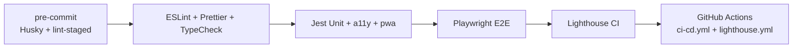

<p align="center">
  
</p>

<h1 align="center">YYC³ AI App Intelligence Platform</h1>

<p align="center">
  <em>言启象限 · 语枢未来 — Words Initiate Quadrants, Language Serves as Core for Future</em>
</p>

<p align="center">
  企业级移动应用智能分析平台 · 面向 AI 时代的 App 全链路决策引擎<br/>
  Enterprise-grade analytics & intelligence platform for mobile app developers
</p>

---

## 📜 徽章系统 · Badge System

<p align="center">
  <!-- 核心身份徽章 -->
  
  
  
  
</p>

<p align="center">
  <!-- 技术栈徽章 -->
  
  
  
  
  
  
  
  
  
</p>

<p align="center">
  <!-- 质量与 CI 徽章 -->
  
  
  
  
  
  
  
  
</p>

<p align="center">
  <!-- 生态与社区徽章 -->
  
  
  
  
  
  
  
  
  
  
</p>

---

## 📐 项目定位 · Project Overview

YYC³ AI App Intelligence Platform（YYC³-aiapp）是 **YYC³ Family** 旗下的核心 Web 应用层，构建移动应用市场的「**洞察 → 决策 → 执行 → 反馈**」全链路智能闭环。

| 维度         | 内容                                                                                      |
| ------------ | ----------------------------------------------------------------------------------------- |
| **平台定位** | 企业级 AI 智能应用分析平台（PWA + SPA 双形态）                                            |
| **核心用户** | 移动应用开发者 / 增长团队 / 产品经理 / 数据分析师                                         |
| **核心能力** | App 情报探索 · 市场发现 · ASO · 创意分析 · 评测智能 · 商业化策略 · 定价智能 · AI 学习闭环 |
| **架构范式** | React 18 + Vite 5 + shadcn/ui + Radix UI + Tailwind 3 + Framer Motion + Recharts          |
| **质量基线** | TypeScript Strict · ESLint · Prettier · Husky · Jest · Playwright · Lighthouse · axe-core |

---

## 🧬 五高五标五化五维 · Architecture DNA

```
┌──────────────────────────────────────────────────────────────────┐
│                   YYC³ 智能应用核心机制                            │
├──────────────────────────────────────────────────────────────────┤
│  五高架构   高可用 │ 高性能 │ 高安全 │ 高扩展 │ 高智能            │
│  五标体系   标准化 │ 规范化 │ 自动化 │ 可视化 │ 智能化            │
│  五化转型   流程化 │ 数字化 │ 生态化 │ 工具化 │ 服务化            │
│  五维评估   时间维 │ 空间维 │ 属性维 │ 事件维 │ 关联维            │
└──────────────────────────────────────────────────────────────────┘
```

> 详见 [`docs/YYC3-团队通用-标准规范/YYC3-核心机制-五高五标五化五维.md`](./docs/YYC3-团队通用-标准规范/YYC3-核心机制-五高五标五化五维.md)

---

## ✨ 核心功能矩阵 · Module Matrix

| 类别             | 模块                                              | 描述                                   |
| ---------------- | ------------------------------------------------- | -------------------------------------- |
| **分析枢纽**     | `Explorer` · `Trends` · `CrossAnalysis`           | App 情报探索、市场趋势、跨模块洞察     |
| **ASO & 创意**   | `ASO` · `Creative` · `Paywall`                    | 应用商店优化、创意素材分析、付费墙策略 |
| **市场 & 策略**  | `Markets` · `Features` · `Pricing` · `Reviews`    | 市场发现、特性矩阵、定价智能、评论智能 |
| **学习 & 智能**  | `Learning` · `Assistant` · `Ideas`                | 反馈闭环、知识图谱、AI 助手、Idea 生成 |
| **销售 & 协作**  | `Sales` · `ABTesting` · `HumanAICollaboration`    | 销售管线、A/B 实验、人机协作           |
| **PWA & 可达性** | `PWAProvider` · `InstallPrompt` · `Accessibility` | 离线可用、安装提示、WCAG 2.2 AA        |

---

## 🗂️ 仓库结构 · Repository Layout

```text
YYC3-AI-App-Intelligence-Platform/
├── public/
│   ├── Family-001.png              # YYC³ Family 全家福顶图
│   └── yyc3-icons/                 # 全端 Logo 资产（Android/iOS/PWA/Favicon/WebP）
│       ├── android/                # mipmap-hdpi…xxxhdpi + playstore-icon
│       ├── ios/                    # 20~1024 全尺寸
│       ├── pwa/                    # 72~512 + manifest.json
│       ├── favicon/                # 16/32/96 + .ico
│       └── webp/                   # 192/512 WebP 优化版
├── components/
│   ├── ui/                         # shadcn/ui 组件库（48+ 原子组件）
│   ├── modules/                    # 业务模块（15+ 智能模块）
│   ├── nara/                       # NARA 控制台（Home/Chat/Loop）
│   ├── pwa/                        # PWA Provider / InstallPrompt
│   └── accessibility/              # 可访问性增强组件
├── __tests__/                      # Jest 单测（hooks / a11y / pwa / perf）
├── docs/                           # YYC³ 标准规范 & 设计文档
├── .github/workflows/              # CI/CD · Lighthouse
├── vite.config.ts                  # Vite + VitePWA 配置
└── package.json
```

---

## 🚀 快速开始 · Quick Start

### 环境要求

| 工具        | 最低版本                        | 说明                           |
| ----------- | ------------------------------- | ------------------------------ |
| **Node.js** | `>= 18.0.0`                     | 推荐 LTS                       |
| **pnpm**    | `>= 9`                          | 团队首推包管理器（与 CI 一致） |
| 浏览器      | Chrome / Edge / Safari 最新两版 | PWA & ESM 支持                 |

### 安装与运行

```bash
# 1. 克隆仓库
git clone https://github.com/YYC-Cube/YYC3-AI-App-Intelligence-Platform.git
cd YYC3-AI-App-Intelligence-Platform

# 2. 安装依赖（推荐 pnpm）
pnpm install
# 或：npm install / yarn install

# 3. 启动开发服务器（默认 http://localhost:3200）
pnpm dev

# 4. 生产构建
pnpm build

# 5. 本地预览生产构建
pnpm preview
```

### 常用脚本

| 命令                                | 作用                                        |
| ----------------------------------- | ------------------------------------------- |
| `pnpm dev`                          | 启动开发服务器（端口 3200，自动打开浏览器） |
| `pnpm build`                        | TypeScript 检查 + Vite 生产构建             |
| `pnpm typecheck`                    | 仅类型检查                                  |
| `pnpm lint` / `pnpm lint:fix`       | ESLint 检查 / 自动修复                      |
| `pnpm format` / `pnpm format:check` | Prettier 格式化 / 检查                      |
| `pnpm test` / `pnpm test:coverage`  | Jest 单测 / 覆盖率                          |
| `pnpm e2e` / `pnpm e2e:ui`          | Playwright E2E / 可视化模式                 |
| `pnpm lighthouse`                   | Lighthouse 性能审计                         |
| `pnpm a11y`                         | 无障碍单测（jest-axe）                      |
| `pnpm pwa`                          | PWA 相关单测                                |

---

## 🎨 全端 Logo · Brand Asset Matrix

YYC³ Logo 已在 [`public/yyc3-icons/`](./public/yyc3-icons) 下提供 **Android / iOS / PWA / Favicon / WebP** 全端适配资产，并已在以下入口正确引入：

| 入口              | 引入资产                                                      | 路径                                                                           |
| ----------------- | ------------------------------------------------------------- | ------------------------------------------------------------------------------ |
| **HTML `<head>`** | favicon · apple-touch-icon · manifest                         | [`index.html`](./index.html)                                                   |
| **PWA Manifest**  | 72×72 ~ 512×512 全尺寸（含 maskable）                         | [`public/yyc3-icons/pwa/manifest.json`](./public/yyc3-icons/pwa/manifest.json) |
| **Vite PWA**      | `includeAssets` + `manifest.icons` + `workbox.runtimeCaching` | [`vite.config.ts`](./vite.config.ts)                                           |

> 📖 完整 PWA 接入与 Logo 使用规范：[`docs/YYC3-规划设计-PWA指南.md`](./docs/YYC3-规划设计-PWA指南.md)

---

## 🛡️ 五高架构 · Five-High Architecture

| 高         | 落地实现                                                                                   |
| ---------- | ------------------------------------------------------------------------------------------ |
| **高可用** | ErrorBoundary · PWA 离线缓存 · Workbox NetworkFirst                                        |
| **高性能** | Vite Terser 压缩 · manualChunks 分包 · drop_console · 路由级懒加载（`LazyComponents.tsx`） |
| **高安全** | CSP-ready · 无密钥入库 · Husky pre-commit · ESLint 安全规则                                |
| **高扩展** | 模块化 `components/modules/*` · shadcn/ui 可组合 · 配置驱动导航                            |
| **高智能** | NARA 控制台 · Learning 闭环 · KnowledgeGraph · PredictiveAnalytics                         |

---

## 🧪 质量与自动化 · Quality & Automation



- **Lighthouse CI**：`.github/workflows/lighthouse.yml`
- **CI/CD**：`.github/workflows/ci-cd.yml`（代码质量 → 单测 → E2E → 构建）
- **无障碍**：`__tests__/accessibility/` + `jest-axe`，目标 WCAG 2.2 AA
- **PWA**：`__tests__/pwa/` + VitePWA `autoUpdate`

---

## 📚 开发者文档五件套 · Developer Docs

| 文档                                            | 说明                                         |
| ----------------------------------------------- | -------------------------------------------- |
| 📄 [`LICENSE`](./LICENSE)                       | MIT 开源协议                                 |
| 🤝 [`CONTRIBUTING.md`](./CONTRIBUTING.md)       | 贡献指南（分支策略 / Commit 规范 / PR 流程） |
| 🌱 [`CODE_OF_CONDUCT.md`](./CODE_OF_CONDUCT.md) | Contributor Covenant v2.1 行为准则           |
| 📝 [`CHANGELOG.md`](./CHANGELOG.md)             | 版本变更日志（Keep a Changelog 规范）        |
| 🔒 [`SECURITY.md`](./SECURITY.md)               | 安全策略与漏洞披露流程                       |

### 进阶文档

- 📐 [`docs/YYC3-团队通用-标准规范/YYC3-团队规范-开发标准.md`](./docs/YYC3-团队通用-标准规范/YYC3-团队规范-开发标准.md)
- 📊 [`docs/PLATFORM_STATUS.md`](./docs/PLATFORM_STATUS.md)
- 🚀 [`docs/YYC3-规划设计-PWA指南.md`](./docs/YYC3-规划设计-PWA指南.md)
- ♿ [`docs/YYC3-无障碍性-优化指南.md`](./docs/YYC3-无障碍性-优化指南.md)
- ⚡ [`docs/YYC3-智能性能-基准配置.md`](./docs/YYC3-智能性能-基准配置.md)
- 🧭 [`docs/YYC3-导航架构-导航分类.md`](./docs/YYC3-导航架构-导航分类.md)

---

## 🤝 参与贡献 · Contributing

我们欢迎一切形式的贡献！请先阅读 [CONTRIBUTING.md](./CONTRIBUTING.md) 与 [CODE_OF_CONDUCT.md](./CODE_OF_CONDUCT.md)。

```bash
# 1. Fork & Clone
# 2. 创建特性分支
git checkout -b feat/your-feature

# 3. 遵循 Conventional Commits
git commit -m "feat(modules): add new ASO insight card"

# 4. 推送并创建 PR
git push origin feat/your-feature
```

---

## 🗺️ 路线图 · Roadmap

- [x] **v1.0.0** · 15+ 智能模块全量上线 · PWA Ready · CI/CD 闭环
- [ ] **v1.1.0** · Learning Engine 子模块深化 · KnowledgeGraph 全量接入
- [ ] **v1.2.0** · 国际化 i18n · 多主题切换 · 数据可视化升级
- [ ] **v1.3.0** · 实时数据流 · WebSocket 智能告警 · Edge 部署
- [ ] **v2.0.0** · AI Agent 编排 · 多模型路由 · 端侧推理适配

详见 [`docs/YYC3-项目设计-改进规划.md`](./docs/YYC3-项目设计-改进规划.md)。

---

## 📮 联系与支持 · Contact

- **团队**：YYC³ Team · YanYuCloudCube
- **邮箱**：[admin@0379.email](mailto:admin@0379.email)
- **问题反馈**：[GitHub Issues](https://github.com/YYC-Cube/YYC3-AI-App-Intelligence-Platform/issues)
- **讨论区**：[GitHub Discussions](https://github.com/YYC-Cube/YYC3-AI-App-Intelligence-Platform/discussions)

---

## 📄 许可证 · License

本项目基于 [MIT License](./LICENSE) 开源。

---

<p align="center">
  <em>© 2026 YYC³ · YanYuCloudCube — 言启千行代码 · 语枢万物智能</em>
</p>
